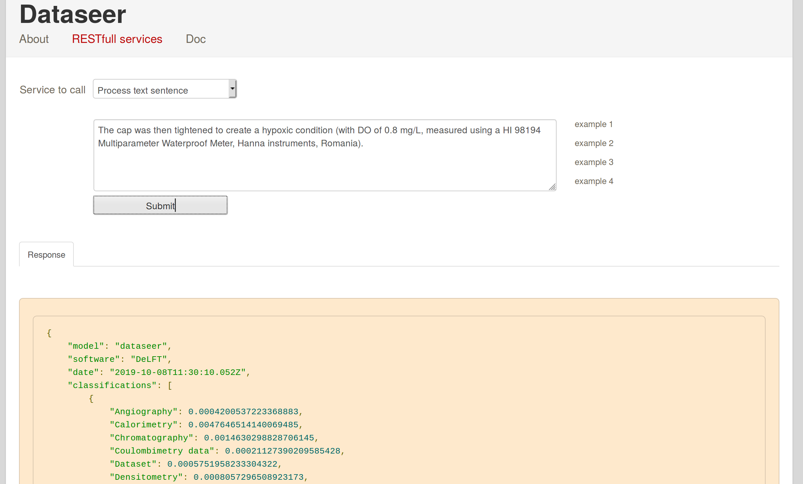

# DataSeer-ML


**dataseer-ml** is a GROBID module able to identify implicit mentions of datasets in a scientific article and to clasify the identified dataset in a hierarchy of dataset types, these data types being directly derived from MeSH. It is a back-end service used by the [DataSeer-Web application](https://github.com/kermitt2/dataseer-web). 

The goal of this process is to further drive the authors of the article to the best research data sharing practices, i.e. to ensure that the dataset is associated with data availability statement, permanent identifiers and in general requirements regarding Open Science and reproducibility. This further process is realized by the dataseer web application which includes a GUI to be used by the authors, suggesting data sharing policies based on the predicted data types for each identified dataset.  

The module can process a variety of scientific article formats, including mainstream publisher's native XML submission formats: PDF, TEI, JATS/NLM, ScholarOne, BMJ, Elsevier staging format, OUP, PNAS, RSC, Sage, Wiley, etc.

`.docx` format is also supported in a GROBID specific branch, but not yet merged. 

# Approach

## Dataset identification and classification

The processing of an article follows 5 steps: 

1. Given an article to be processed by DataSeer, the document is first parsed and structured automatically by [Grobid](https://github.com/kermitt2/grobid). This includes metadata extraction and consolidation against CrossRef and PubMed, structuring the text body and bibliographical references. 

2. The document body is then segmented into sentences thanks to OpenNLP with some customization to better support scientific texts (i.e. avoiding wrong sentence break in the middle of reference callout or in the middle of scientific notations). 

3. Each sentence is going through a cascade of text classifiers, all based on a fine-tuned [SciBERT](https://github.com/allenai/scibert) deep learning architecture, to predict if the sentence introduce a dataset, and if yes, which dataset type and sub type is introduced. 

4. The text body is then processed by a sequence labeling model which aims at recognizing the section relevant to dataset introductions and presentations. "Materials and Methods" for instance is a usual relevant section, but other sections might be relevant and the "Materials and Methods" sections can appeared with a variety of section headers. This sequence labelling process is realized by CRF using various features including the predictions produced in the previous steps 3.

5. A final selection of the predicted datasets takes place for the sections identified as introducing potentially datasets, using the result of the sentence classification of step 3 for predicting additionally the type and subtype of the recognized datasets. 

The result of the service is a TEI file representing the article, enriched with sentence boundaries and predicted data set information. 

## Training

The DataSeer dataset describes all the dataset contexts from 2000 Open Access articles from PLOS, classified into the taxonomy of data types developed at the Dataseer [ResearchDataWiki](http://wiki.dataseer.io/doku.php). It contains 13,777 manually classified/annotated sentences about datasets (in average 6.89 dataset contexts per article). See our [Jupyter Notebook](https://github.com/kermitt2/dataseer-ml/blob/master/notebook/training-analysis-all.ipynb) for some analysis of the dataset.

After alignment with the actual content of the full article bodies (via [Grobid](https://github.com/kermitt2/grobid)), this dataset is used both for training the recognition of sections introducing datasets (so called "zoning" task implemented with CRF using the Wapiti library) and the data type and subtype classifiers ([SciBERT](https://github.com/allenai/scibert)).

# Build

Install GROBID:

> git clone https://github.com/kermitt2/grobid

Install then *dataseer-ml* and move it as a sub-module of GROBID:

> git clone https://github.com/kermitt2/dataseer-ml

> mv dataseer-ml grobid/

Install DeLFT:

> git clone https://github.com/kermitt2/delft

Follow the installation described in the [DeLFT documentation](https://github.com/kermitt2/delft#install). If necessary, update the path to the DeLFT installation in the `grobid.properties` file located under `grobid-home/config/grobid.properties`.

By default, the project can process scientific articles in PDF and TEI formats. To process JATS/NLM, scholarOne and a variety of other native publisher formats, Pub2TEI needs to be installed: 

> git clone https://github.com/kermitt2/Pub2TEI

If required, update the path to the Pub2TEI installation in the `dataseer-ml.properties` file located under `dataseer-ml/src/main/resources/`:

```
# path to Pub2TEI repository as available at https://github.com/kermitt2/Pub2TEI
grobid.dataseer.pub2tei.path=../../Pub2TEI/
```

Build dataseer-ml:

> cd grobid/dataseer-ml

> ./gradlew clean install


# Web service API

## Start the service

> ./gradlew appRun

## Service console

Javascript demo/console web app is then accessible at ```http://localhost:8060```. From the console and the `RESTfull services` tab, you can process chunk of text (select `Process text Sentence`), process a complete PDF document (select `Process PDF`), process a TEI document (select `Process TEI`) or process an XML publisher native document (such as JATS - select `Process JATS/NLM/...`) .



## Process a sentence

Identify if the sentence introduces a dataset, if yes classify the dataset type.

Example: 

> curl -X POST -d "text=This is a sentence." http://localhost:8060/service/processDataseerSentence

> curl -GET --data-urlencode "text=This is a another sentence." http://localhost:8080/service/processDataseerSentence


## Process a TEI document

Upload a TEI document, identify dataset introductory section, segment into sentences, identify sentence introducing a dataset and classify the dataset type. Return the TEI document enriched with Dataseer information.

Example:

> curl --form input=@./resources/samples/journal.pone.0198050.tei.xml localhost:8060/service/processDataseerTEI


## Process a PDF document

Upload a PDF document, extract its content and convert it into structured TEI (via GROBID), identify dataset introductory section, segment into sentences, identify sentence introducing a dataset and classify the dataset type. Return a TEI representation of the PDF, enriched with Dataseer information.

Example:

> curl --form input=@./resources/samples/journal.pone.0198050.pdf localhost:8060/service/processDataseerPDF

## Process native publisher XML document

Upload a publisher native XML format document, convert it into structured TEI (via Pub2TEI), identify dataset introductory section, segment into sentences, identify sentence introducing a dataset and classify the dataset type. Return a TEI representation of the PDF, enriched with Dataseer information.

Example:

> curl --form input=@./resources/samples/journal.pone.0198050.xml localhost:8060/service/processDataseerJATS

See [Pub2TEI](https://github.com/kermitt2/Pub2TEI) for the exact list of supported formats.

# Training data assembling and generating classification models

## Importing and assembling training data

Training data is available in a tabular format with reference to Open Access articles. The following process will align these tabular data (introduced by parameter `-Pcsv`) with the actual article content (JATS/NLM and PDF via GROBID) to create a full training corpus. 

> ./gradlew annotated_corpus_generator_csv -Ppdf=PATH/TO/THE/FULL/TEXTS/PDF -Pfull=PATH/TO/THE/FULL/TEXTS/NLM/ -Pcsv=PATH/TO/THE/TABULAR/TRAINING/DATA -Pxml=PATH/WHERE/TO/WRITE/THE/ASSEMBLED/TRAINING/DATA

For instance:

> ./gradlew annotated_corpus_generator_csv -Ppdf=/mnt/data/resources/plos/pdf/ -Pfull=/mnt/data/resoues/plos/nlm/ -Pcsv=resources/dataset/dataseer/csv/ -Pxml=resources/dataset/dataseer/corpus/

Some reports will be generated to describe the alignment failures. 

## Training the classification models

The classifier models are relying on the [DeLFT](https://github.com/kermitt2/delft) deep learning library, which is integrated in Grobid. 

After assembling the training data, the classification models can be trained with the following command under the DeFLT project:

> cd delft
> python3 dataseerClassifier.py train --architecture=scibert

Possible architectures are documented in the DeLFT project. 

For producing an evaluation (including n-fold cross evaluation), see the DeLFT documentation.

[To Be Completed]

## Training the dataset-relevant section identifier model

Train:

> ./gradlew train_dataseer -PgH=/path/grobid/home

Evaluation with a random split of the annotated data with a ratio of 0.9 (90% training, 10% evaluation):

> ./gradlew eval_dataseer_split -PgH=/path/grobid/home -Ps=0.9

10-fold cross-evaluation:

> ./gradlew eval_dataseer_nfold -PgH=/path/grobid/home -Pt=10


## Benchmarking

Here are some benchmarkings on the dataset recognition and data type classification tasks. Given the sparsity of the training examples for some data types, actually only a subset of major data types can be currently predicted.  

The evaluated classification models are: 

* `BiGRU` is a robust deep learning text classifier using two bidirectional GRU as visible [here](https://github.com/kermitt2/delft/blob/master/delft/textClassification/models.py#L471), 

* `bert-base-en` is a fine-tuned BERT base model as made available by Google Research (BERT-Base, Cased, 12-layer, 768-hidden, 12-heads, 110M parameters), see [here](https://storage.googleapis.com/bert_models/2018_10_18/cased_L-12_H-768_A-12.zip), and 

* SciBERT (cased) is a BERT architecture trained on scientific literature by AI2, see [here](https://s3-us-west-2.amazonaws.com/ai2-s2-research/scibert/tensorflow_models/scibert_scivocab_cased.tar.gz). 

SciBERT provides almost always the best classification accuracy. 

Tasks and evaluations: 

* binary classifier task: predict if the sentence introduces or not a dataset. We trained with 21,042 examples (approx. 55% positive, 45% negative). 

```
BiGRU
-----
                   precision        recall       f-score       support
       dataset        0.8619        0.9465        0.9022          1121
    no_dataset        0.9198        0.8019        0.8568           858

bert-base-en
------------
                   precision        recall       f-score       support
       dataset        0.8466        0.9795        0.9082          1121
    no_dataset        0.9663        0.7681        0.8558           858 

SciBERT
-------
                   precision        recall       f-score       support
       dataset        0.9053        0.9233        0.9142          1108
    no_dataset        0.8975        0.8743        0.8857           851
```

* first level-taxonomy classification: given a sentence we evaluate if it introduces a high-level data type or no dataset. The first level dataset taxonomy contains a total of 29 data types which corresponds to MeSH classes, see the Dataseer [ResearchDataWiki](http://wiki.dataseer.io/doku.php). In the following evaluation report, we keep zero prediction class for information. No prediction happens when there are too few examples in the training data for this data type, which is the case for around 2/3 of the data types. 

```
BiGRU
-----
                   precision        recall       f-score       support
   Angiography        0.0000        0.0000        0.0000             1
   Calorimetry        0.0000        0.0000        0.0000             1
Chromatography        0.6667        0.5455        0.6000            11
Coulombimetry         0.0000        0.0000        0.0000             0
       Dataset        0.4828        0.6222        0.5437            45
  Densitometry        0.0000        0.0000        0.0000             0
Digital Drople        0.0000        0.0000        0.0000             0
Electrocardiog        0.0000        0.0000        0.0000             3
Electroencepha        1.0000        1.0000        1.0000             2
Electromyograp        0.0000        0.0000        0.0000             3
Electrooculogr        0.0000        0.0000        0.0000             1
Electrophysiol        0.0000        0.0000        0.0000             0
Electroretinog        0.0000        0.0000        0.0000             0
Emission flame        0.0000        0.0000        0.0000             1
Flow cytometry        0.9444        0.8095        0.8718            21
  Genetic Data        0.7879        0.6341        0.7027            41
         Image        0.7875        0.8289        0.8077           152
Mass Spectrome        0.0000        0.0000        0.0000             4
  Protein Data        0.0000        0.0000        0.0000             1
Real-Time Poly        0.8286        0.8788        0.8529            33
    Sound data        0.0000        0.0000        0.0000             1
  Spectrometry        0.7308        0.7917        0.7600            48
Spectrum Analy        0.0000        0.0000        0.0000             0
Spirometry dat        0.0000        0.0000        0.0000             0
  Tabular data        0.8156        0.8048        0.8102           753
Video Recordin        0.0000        0.0000        0.0000             2
Voltammetry da        0.0000        0.0000        0.0000             1
X-Ray Diffract        0.0000        0.0000        0.0000             7
X-Ray fluoresc        0.0000        0.0000        0.0000             0
    no_dataset        0.8459        0.8663        0.8560           830

bert-base-en
------------
                   precision        recall       f-score       support
   Angiography        0.0000        0.0000        0.0000             1
   Calorimetry        0.0000        0.0000        0.0000             1
Chromatography        0.0000        0.0000        0.0000            11
Coulombimetry         0.0000        0.0000        0.0000             0
       Dataset        0.7368        0.3111        0.4375            45
  Densitometry        0.0000        0.0000        0.0000             0
Digital Drople        0.0000        0.0000        0.0000             0
Electrocardiog        0.0000        0.0000        0.0000             3
Electroencepha        0.0000        0.0000        0.0000             2
Electromyograp        0.0000        0.0000        0.0000             3
Electrooculogr        0.0000        0.0000        0.0000             1
Electrophysiol        0.0000        0.0000        0.0000             0
Electroretinog        0.0000        0.0000        0.0000             0
Emission flame        0.0000        0.0000        0.0000             1
Flow cytometry        0.9091        0.4762        0.6250            21
  Genetic Data        0.5490        0.6829        0.6087            41
         Image        0.7204        0.8816        0.7929           152
Mass Spectrome        0.0000        0.0000        0.0000             4
  Protein Data        0.0000        0.0000        0.0000             1
Real-Time Poly        0.6667        0.9697        0.7901            33
    Sound data        0.0000        0.0000        0.0000             1
  Spectrometry        0.7049        0.8958        0.7890            48
Spectrum Analy        0.0000        0.0000        0.0000             0
Spirometry dat        0.0000        0.0000        0.0000             0
  Tabular data        0.7670        0.8964        0.8267           753
Video Recordin        0.0000        0.0000        0.0000             2
Voltammetry da        0.0000        0.0000        0.0000             1
X-Ray Diffract        0.0000        0.0000        0.0000             7
X-Ray fluoresc        0.0000        0.0000        0.0000             0
    no_dataset        0.9391        0.7988        0.8633           830

SciBERT
-------
                   precision        recall       f-score       support
   Angiography        0.0000        0.0000        0.0000             1
   Calorimetry        0.0000        0.0000        0.0000             1
Chromatography        0.6471        1.0000        0.7857            11
Coulombimetry         0.0000        0.0000        0.0000             0
       Dataset        0.4576        0.6000        0.5192            45
  Densitometry        0.0000        0.0000        0.0000             0
Digital Drople        0.0000        0.0000        0.0000             0
Electrocardiog        0.0000        0.0000        0.0000             3
Electroencepha        0.0000        0.0000        0.0000             2
Electromyograp        0.0000        0.0000        0.0000             3
Electrooculogr        0.0000        0.0000        0.0000             1
Electrophysiol        0.0000        0.0000        0.0000             0
Electroretinog        0.0000        0.0000        0.0000             0
Emission flame        0.0000        0.0000        0.0000             1
Flow cytometry        0.8696        0.9524        0.9091            21
  Genetic Data        0.5000        0.7317        0.5941            41
         Image        0.7826        0.9474        0.8571           152
Mass Spectrome        1.0000        0.2500        0.4000             4
  Protein Data        0.0000        0.0000        0.0000             1
Real-Time Poly        0.7750        0.9394        0.8493            33
    Sound data        0.0000        0.0000        0.0000             1
  Spectrometry        0.6567        0.9167        0.7652            48
Spectrum Analy        0.0000        0.0000        0.0000             0
Spirometry dat        0.0000        0.0000        0.0000             0
  Tabular data        0.8087        0.8924        0.8485           753
Video Recordin        0.0000        0.0000        0.0000             2
Voltammetry da        0.0000        0.0000        0.0000             1
X-Ray Diffract        0.0000        0.0000        0.0000             7
X-Ray fluoresc        0.0000        0.0000        0.0000             0
no_dataset            0.9588        0.7855        0.8636           830
```


* second level taxonomy: for the first leval data types that can be predicted by the first level classifier, we build a serie of additional classifier to predict a second level data type, assuming a cascaded approach. See the Dataseer [ResearchDataWiki](http://wiki.dataseer.io/doku.php) for more details about the data types.

```
BiGRU
-----

Evaluation Chromatography subtypes
Evaluation on 12 instances:
                   precision        recall       f-score       support
High Pressure Liq. 0.5833           1.0000        0.7368             7


Evaluation Dataset subtypes
Evaluation on 34 instances:
                   precision        recall       f-score       support
Existing datas        0.9032        0.9655        0.9333            29
Systematic Rev        0.6667        0.4000        0.5000             5


Evaluation Genetic Data subtypes
Evaluation on 46 instances:
                   precision        recall       f-score       support
High-Throughpu        0.7500        0.9000        0.8182            10
Sequence Analy        0.4118        1.0000        0.5833            14


Evaluation Image subtypes
Evaluation on 145 instances:
                   precision        recall       f-score       support
Electrophoresi        0.7500        0.9600        0.8421            25
    Microscopy        0.9577        0.9189        0.9379            74
Magnetic Reson        0.3158        0.7500        0.4444             8
           nan        0.5714        0.6667        0.6154            18

Evaluation Mass Spectrometry subtypes
Evaluation on 5 instances:
                   precision        recall       f-score       support
Gas Chromatogr        0.6000        1.0000        0.7500             3

Evaluation Spectrometry subtypes
Evaluation on 51 instances:
                   precision        recall       f-score       support
Spectrophotome        0.5490        1.0000        0.7089            280

Evaluation Tabular data subtypes
Evaluation on 762 instances:
                   precision        recall       f-score       support
           nan        0.8148        0.8894        0.8505           470
         Assay        0.7288        0.6719        0.6992            64
   Fluorometry        0.9000        0.6000        0.7200            15
Sampling Studi        0.3889        0.1944        0.2593            36
Research Subje        0.7687        0.6975        0.7314           162
   Immunoassay        0.8667        0.8667        0.8667            15


bert-base-en
------------

Evaluation Chromatography subtypes
                   precision        recall       f-score       support
Chromatography        0.5455        1.0000        0.7059             6


Evaluation Dataset subtypes
                   precision        recall       f-score       support
Existing datas        0.9070        1.0000        0.9512            39


Evaluation Genetic Data subtypes
                   precision        recall       f-score       support
High-Throughpu        0.4091        1.0000        0.5806             9
Sequence Analy        0.4375        0.4375        0.4375            16


Evaluation Image subtypes
                   precision        recall       f-score       support
Computerized T        0.3500        0.7778        0.4828             9
Electrophoresi        0.9062        0.9667        0.9355            30
    Microscopy        0.8158        1.0000        0.8986            62
Magnetic Reson        1.0000        0.0833        0.1538            12
           nan        0.6667        0.2353        0.3478            17


Evaluation Mass Spectrometry subtypes
                   precision        recall       f-score       support
Gas Chromatogr        0.5000        0.6667        0.5714             3


Evaluation Spectrometry subtypes
                   precision        recall       f-score       support
Spectrophotome        0.6667        1.0000        0.8000            22


Evaluation Tabular data subtypes
                   precision        recall       f-score       support
           nan        0.8065        0.8789        0.8412           479
         Assay        0.6711        0.6711        0.6711            76
   Fluorometry        0.6129        0.8636        0.7170            22
Sampling Studi        0.5333        0.2222        0.3137            36
Research Subje        0.7628        0.7212        0.7414           165
   Immunoassay        0.7500        0.1429        0.2400            21


SciBERT
-------

Evaluation Chromatography subtypes
                   precision        recall       f-score       support
High Pressure Liq. 0.5455           1.0000        0.7059             6


Evaluation Dataset subtypes
                   precision        recall       f-score       support
Existing datas        0.9070        1.0000        0.9512            39


Evaluation Genetic Data subtypes
                   precision        recall       f-score       support
High-Throughpu        0.3462        1.0000        0.5143             9
Sequence Analy        0.5833        0.4375        0.5000            16


Evaluation Image subtypes
                   precision        recall       f-score       support
Computerized T        0.8750        0.7778        0.8235             9
Electrophoresi        1.0000        1.0000        1.0000            30
    Microscopy        0.9385        0.9839        0.9606            62
Magnetic Reson        0.7857        0.9167        0.8462            12
Ultrasonograph        0.5000        1.0000        0.6667             1
           nan        0.7500        0.7059        0.7273            17


Evaluation Mass Spectrometry subtypes
                   precision        recall       f-score       support
Gas Chromatogr     0.5000        1.0000        0.6667             3


Evaluation Spectrometry subtypes
                   precision        recall       f-score       support
Spectrophotome        0.6667        1.0000        0.8000            22


Evaluation Tabular data subtypes
                   precision        recall       f-score       support
           nan        0.8416        0.8539        0.8477           479
         Assay        0.7183        0.6711        0.6939            76
   Fluorometry        0.8636        0.8636        0.8636            22
Sampling Studi        0.4483        0.3611        0.4000            36
Research Subje        0.7401        0.7939        0.7661           165
   Immunoassay        0.7368        0.6667        0.7000            21
```

# Additional convenient scripts

## Load training data documents in the dataseer web application

All the documents present in the local training data repository (after importing the training, see above) under `dataseer-ml/resources/dataset/dataseer/corpus/` will be loaded via the dataseer web API. 

> cd scripts/

> node loader.js


## Convert data type information from the DataSeer Doku Wiki to JSON

The following Python script converts the data type specification from the DataSeer Doku Wiki (http://wiki.dataseer.io) into a JSON representation used by the [DataSeer Web application](https://github.com/kermitt2/dataseer-web). In addition, it will use the training file(s) to inject counts for each datatype. These frequency information can are used by the [DataSeer Web application](https://github.com/kermitt2/dataseer-web) to provide a default ranking of datatypes in the drop down menus when a datatype is assigned manually.   

> cd scripts/

>  pip3 install pandas beautifulsoup4

> python3 converter.py ../resources/DataTypes.csv ../resources/DataTypes.json

Note that at the end of the DataSeer Doku Wiki conversion, the script will report data types in the training data inconsistent with the DataSeer 
Doku Wiki. Those data types must be reviewed and updated to be consistent with Wiki, and the machine learning models must be retrained with the updated training data to produce the new data types. 

## Contact and License

Author and contact: Patrice Lopez (<patrice.lopez@science-miner.com>)

The development of dataseer-ml is supported by a [Sloan Foundation](https://sloan.org/) grant, see [here](https://coko.foundation/coko-receives-sloan-foundation-grant-to-build-dataseer-a-missing-piece-in-the-data-sharing-puzzle/)

DataSeer-ml is distributed under [MIT license](https://opensource.org/licenses/MIT), copyright Aspiration
